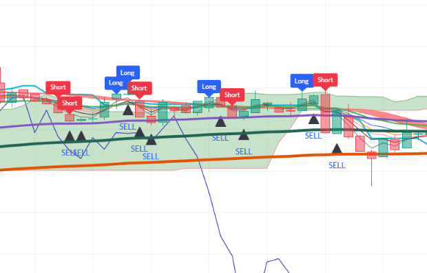

# Pine-Script-JH0-Trend-Strategy-Indicator
Indicator based on 3-minute EMA ribbon crossovers (fast EMAs crossing EMA 20), strictly ordered 3-minute multi-length RSI momentum, visual Ichimoku Kinko Hyo overlay, Hull Suite band, and dynamic higher-timeframe session anchors with a modular "Use" toggle architecture. Signals entry for long/short positions on 3-minute cryptocurrency charts on TradingView.
--
## Chart Preview

--
## Motivation & Problem
- **Lagging Indicator Stacks & Counter-Trend Fakeouts**: Basic moving average crossover systems produce late entries during strong trends and constant false alarms during consolidation, while rigid filtering stacks frequently block valid trend continuation trades.
- **The Core Goal**: To establish a clean, foundational trading framework (JH0) combining fast-response EMA ribbon crossovers (lengths 3, 5, 7, 9 crossing EMA 20) with strict sequential RSI momentum confirmation (lengths 7, 9, 10 above 55 or below 45), backed by modular boolean switches and real-time session open price anchors.
--
## Strategy Logic & Architecture
- This indicator avoids false signals and wrong interpretation of the trend by utilizing a **rule-based, multi-factor filtering system**:
### Core Components:
1. **Trend & Ribbon Filters (EMA Ribbon & Hull Suite)**:
  - Deploys a 10-period EMA ribbon (lengths 3, 5, 7, 9, 12, 20, 30, 60, 100, 200) computed on the 3-minute timeframe via 'request.security()'.
  - Detects key directional crossover events: fast momentum EMAs 1 to 4 (lengths 3, 5, 7, 9) crossing above or below baseline EMA 20 ('EMACrossUp' / 'EMACrossDown').
  - Features an integrated Hull Suite band (HMA length 55, 240m HTF) for visual macro trend smoothing and color filling.
2. **The "Use" Feature & Ordered Multi-Length RSI**:
  - Introduces dynamic boolean toggles ('UseEMA1to10', 'UseRSI') via ternary bypass logic ('x ? y : true') to toggle individual filters on or off without editing the script.
  - Computes 3-minute RSI across three distinct lengths (7, 9, 10), mandating strict sequential ordering:
    - **Bullish Momentum ('To3RSILong')**: All three RSI lines are above 55 with fast RSI leading ('RSI1 > RSI2 > RSI3').
    - **Bearish Momentum ('To3RSIShort')**: All three RSI lines are below 45 with fast RSI leading downward ('RSI1 < RSI2 < RSI3').
3. **Execution Rules (3-Minute Timeframe)**:
  - **Bullish Signal**: Triggers on the 3m chart when fast EMAs cross above EMA 20 (if enabled) and 3m RSI (7, 9, 10) is sequentially ordered above 55 (if enabled). Renders a blue "Long" label above the bar and emits a "1 Long" alert.
  - **Bearish Signal**: Triggers on the 3m chart when fast EMAs cross below EMA 20 (if enabled) and 3m RSI (7, 9, 10) is sequentially ordered below 45 (if enabled). Renders a red "Short" label above the bar and emits a "1 Short" alert.
  - **Exit Plotshape**: Automatically displays a black "SELL" triangular marker on the candle immediately following any signal entry.
4. **Visual Ichimoku Overlay & Dynamic Session Anchors**:
  - Plots a full Ichimoku Kinko Hyo overlay (Conversion Line 9, Base Line 26, Leading Spans 52) with shaded Kumo Cloud for macro structural context.
  - Real-time calculation of current 1-Hour ('open1H') and 1-Day ('open1D') opening prices, rendered as clean horizontal rays with automatic previous-bar deletion ('line.delete(line1H[1])').
--
## Configurable Parameters
Users can adjust the following parameters inside TradingView's settings panel:
- **Time Frame Inputs**: Default - 1m, 2m, 3m. Configurable intervals for multi-timeframe analysis.
- **EMA Ribbon (Lengths 1-10)**: Default - 3, 5, 7, 9, 12, 20, 30, 60, 100, 200. Toggle switches for signal crossover evaluation ('UseEMA1to10'), global ribbon visualization ('PlotEMA1to10'), and optional EMA 30 display.
- **RSI Time Frame & Lengths**: Default - 3m timeframe, lengths 7, 9, 10. Overbought/oversold momentum thresholds (55 / 45) with 'UseRSI' toggle.
- **Ichimoku Settings**: Default - Conversion Line 9, Base Line 26, Leading Span B 52, Displacement 26 with 'PlotIchimoku' toggle.
- **Hull Suite**: Default - HMA length 55, 240m HTF. Customizable modes (HMA, EHMA, THMA), band transparency, and line thickness with 'PlotHullSuite' toggle.
- **Time Mark (1H & 1D Anchors)**: Customizable line colors and widths for real-time 1-hour and 1-day opening price horizontal levels.
--
## How to Install & Use in TradingView
1. Open any crypto chart (e.g., `BTC/USDT`) on **[TradingView](https://www.tradingview.com/)**.
2. Open the **`Pine Editor`** console at the bottom of the page.
3. Open `JH0.txt` (or your Pine Script file), copy the source code, and paste it into the editor.
4. Click **`Save`** and then click **`Add to Chart`**.
5. Set your chart timeframe to **`3m`** and click the gear icon (`Settings`) on the indicator to adjust parameters as needed.
--
## Key Learnings & Engineering Reflections
1. **Fast-to-Baseline EMA Multi-Cross Architecture**
  - I learned that checking whether any of the four fast momentum lines (EMAs 3, 5, 7, 9) crosses the intermediate EMA 20 baseline provides high sensitivity to fresh momentum impulses without waiting for the slowest moving averages to catch up.
2. **Ordered Multi-Length RSI Velocity Confirmation**
  - I learned that requiring multiple RSI lookback periods (7, 9, 10) to fan out in strict sequential order ('RSI1 > RSI2 > RSI3' above 55) confirms true momentum expansion and effectively prevents entering during erratic consolidations.
3. **Modular Filter Control Using the Ternary Operator (x ? y : true)**
  - I learned that using the ternary operator (x ? y : true) allows effortless toggling of individual conditions. If x (Use toggle) is true, the script evaluates y (the filter condition); if x is false, it returns true as a pass-through bypass, maintaining modular compound boolean logic.
